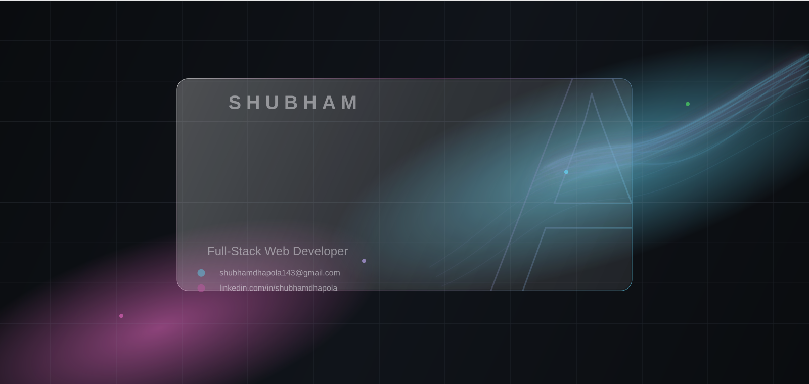

  

  

  
  
  
  
  

---

# 💻 Tech Stack

---

# 📊 GitHub Stats

  

  

  

---

### ✍️ Random Dev Quote

  

---

  <b>Thanks for visiting! 👋</b>

  <i>Keep learning. Keep building. Keep shipping. 🚀</i>

  

